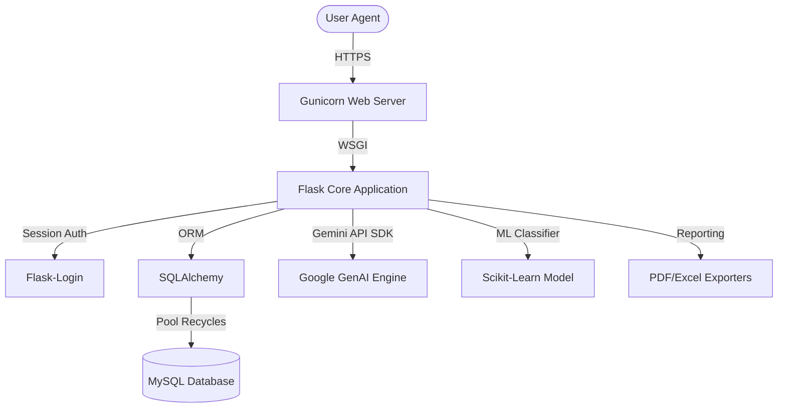

# WalletIQ X — AI-Powered Financial Intelligence Platform

WalletIQ X is a production-grade, enterprise-ready AI personal finance web application. It integrates advanced analytics, machine learning categorization, database isolation, real-time AI advisory, automated goal planning, spending insight detection, and a high-security authentication system.

---

## 🏗️ Architecture & Technical Stack



-   **Backend Core**: Flask (Python 3.14.6)
-   **Security & Session Management**: Flask-Login + Werkzeug PBKDF2:SHA256 (Salted hashing)
-   **Database Layer**: MySQL 8.0, PyMySQL client connection pooling, Flask-Migrate (Alembic)
-   **AI & ML Integration**: Google GenAI SDK (Gemini 2.5), Scikit-Learn (TF-IDF + Multinomial Naive Bayes classifier)
-   **Production Server**: Gunicorn WSGI (multiprocessing worker threads)
-   **Reporting**: ReportLab (PDF), openpyxl (Excel)
-   **CI/CD & Virtualization**: Docker, Docker Compose, GitHub Actions

---

## 🚀 Key Modules & Capabilities

### 1. Smart Authentication System
-   **Username & Email Login**: Supports logging in with either credential.
-   **Strength Checker**: Frontend password strength meter; backend enforces complex criteria.
-   **Stateless Password Reset**: Reset password securely via a 6-digit Recovery PIN (PBKDF2 hashed).

### 2. AI Goal Planner
-   **Automated Saving Targets**: Calculates daily/weekly/monthly savings targets based on deadline.
-   **ML Success Probability**: Predicts target date probability using historic trend regression.
-   **Goal Roadmaps**: Custom AI suggestions to reduce discretionary categories to meet targets.

### 3. AI Spending Insights
-   **Pattern Analysis**: Identifies fastest growing categories, weekend spending spikes, and average daily spending.
-   **Anomaly & Waste Detection**: Alerts on duplicate subscriptions and budget violations.

### 4. Interactive AI Advisor
-   **Context Injection**: Every prompt dynamically loads user-specific income, expenses, goals, and health scores to provide data-driven personal advice.

---

## 📁 Directory Structure
```
.
├── .github/workflows/   # CI/CD pipelines (GitHub Actions)
├── instance/            # Application data instance (SQLite test databases, trained PKL models)
├── logs/                # Rotated production logs (app.log, access.log, error.log)
├── migrations/          # Alembic DB migration version files
├── services/            # Domain-specific Python backend services
├── templates/           # HTML templates & visual styling (vanilla CSS, static responsive layouts)
├── app.py               # Main Flask entrypoint
├── chatbot.py           # Gemini chat context manager
├── Dockerfile           # Production container build
├── docker-compose.yml   # Multi-container local orchestration
├── run.py               # Development launcher
└── requirements.txt     # Pinned Python package dependencies
```

---

## ⚙️ Environment Variables
Configure the following in your `.env` file:
```env
FLASK_APP=app.py
FLASK_ENV=production
SECRET_KEY=generate_secure_random_hex_key
MYSQL_HOST=localhost
MYSQL_PORT=3306
MYSQL_USER=root
MYSQL_PASSWORD=your_mysql_password
MYSQL_DATABASE=walletiqdb
GEMINI_API_KEY=AIzaSy...
```

---

## 🛠️ Installation & Setup

### 1. Local Setup
```bash
# Clone the repository
git clone https://github.com/your-username/walletiq-x.git
cd walletiq-x

# Create virtual environment
python -m venv venv
source venv/bin/activate  # On Windows: venv\Scripts\activate

# Install dependencies
pip install -r requirements.txt

# Run migrations
python -m flask db upgrade

# Start dev server
python run.py
```

### 2. Docker Setup
```bash
docker-compose up --build
```

---

## 📦 Deployment Instructions

### Render
Deploy directly using `render.yaml` infrastructure-as-code blueprint:
```bash
# Trigger build pipeline via Render dashboard mapping to:
gunicorn --config gunicorn.conf.py app:app
```

### Railway
Nixpacks will autodetect settings using `railway.json`.

---

## 📄 License
This project is licensed under the MIT License.
